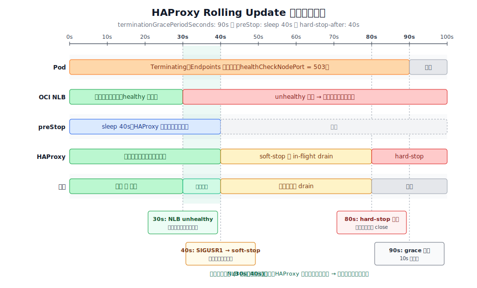

# HAProxy (lemon edge proxy)

OCI Network Load Balancer (NLB) の直下に立つ L4/L7 兼用フロントプロキシ。
クラスタ外から入ってくる全トラフィックの最前段で、以下を担当する。

- TCP のポート振り分け (LDAP/LDAPS, Minecraft, OTLP/Vault audit)
- HTTP / HTTPS の Traefik への中継 (PROXY protocol v2 で送出)
- IP ブロックリスト (`blocked-ips.txt`) による接続拒否
- IP 単位のレート制限 (HTTP: 10 req/sec, HTTPS: 50 conn/sec)

## ファイル構成

| Path                      | 用途                                                          |
|---------------------------|-------------------------------------------------------------|
| `config/namespace.yaml`   | `haproxy` namespace                                         |
| `config/configmap.yaml`   | `haproxy.cfg` 本体 (ConfigMap, `kapp.k14s.io/versioned` 注釈付き) |
| `config/blocked-ips.yaml` | ブロック IP 一覧 (ConfigMap, 同 versioned)                         |
| `config/deployment.yaml`  | Deployment (replicas: 2, RollingUpdate)                     |
| `config/service.yaml`     | Service (`type: LoadBalancer`, OCI NLB)                     |

`kapp.k14s.io/versioned: ""` が付いている ConfigMap は kapp-controller が
中身を変更するたびに新しい名前で作り直し、Deployment の参照先も自動で
差し替える。これによって `haproxy.cfg` を編集すると Pod が rolling update
されて新しい設定が反映される。

## OCI NLB との連携

`Service` には以下の annotation を付けている:

- `oci-network-load-balancer.oraclecloud.com/is-preserve-source: "true"`
  クライアントの送信元 IP をバックエンドまで保つ。レート制限とブロック判定が
  実際のクライアント IP で動くために必須。
- `oci.oraclecloud.com/load-balancer-type: nlb`
- `externalTrafficPolicy: Local`
  Pod が動いている node にのみトラフィックを送るので、kube-proxy による
  追加 NAT が入らず送信元 IP が温存される。代わりに **Pod が居ない node には
  NLB が送らないように、healthCheckNodePort 経由のヘルスチェックが必要**
  (Kubernetes が自動で立てる)。

## Rolling update でのトラフィック断ゼロ化

`kapp kick -n app-install -a haproxy -y` などで設定を反映させると、
HAProxy Pod が rolling update される。このとき以前は curl で `http_code=000`
(connection reset / timeout) が散発的に出ていた。原因は OCI NLB の
ヘルスチェックが node を unhealthy と判断するより先に、HAProxy が落ちて
いたため。

これを防ぐために以下の二段構えにしてある。

### 1. Pod 側 (`config/deployment.yaml`)

```yaml
terminationGracePeriodSeconds: 90
lifecycle:
  preStop:
    exec:
      command: [ "/bin/sh", "-c", "sleep 40" ]
```

- Pod が `Terminating` に入ると、kubelet は **まず preStop を実行してから**
  STOPSIGNAL (haproxy:3.x の image では `SIGUSR1` = soft-stop) を送る。
- `sleep 40` の間 HAProxy は通常通り通信を捌き続けるので、その間に
  OCI NLB のヘルスチェック (約 30 秒で unhealthy 判定) がこの node を
  外し、新規接続は別の node に流れるようになる。
- preStop が終わってから初めて HAProxy が soft-stop を始めるため、
  「NLB はまだ送るが HAProxy はもう死んでいる」という穴が消える。

### 2. HAProxy 側 (`config/configmap.yaml`)

```
global
  hard-stop-after 40s

defaults
  option redispatch
  retries 3
```

- `hard-stop-after 40s`: soft-stop 後に in-flight 接続を最大 40 秒だけ
  drain する。これより長い接続は強制的に閉じる。`terminationGracePeriodSeconds`
  (90s) − `preStop` (40s) = 50s の予算内に収まるので、kubelet による
  SIGKILL が発火する前に確実に綺麗に落ちる。
- `option redispatch` + `retries 3`: バックエンド (主に Traefik) が
  落ちかけたとき、別のサーバーへ再ディスパッチして retry する
  (HTTP モードのみ有効)。

タイムライン全体:



```
0s    Pod が Terminating, Endpoints から外れる
      → healthCheckNodePort が 503 を返し始める
0s    preStop 開始 (sleep 40) — HAProxy は通常稼働
~30s  OCI NLB がこの node を unhealthy と判断 → 新規接続が来なくなる
40s   preStop 完了 → SIGUSR1 → HAProxy soft-stop 開始
40-80s in-flight 接続を drain (hard-stop-after 40s)
80s   残接続を強制 close
90s   terminationGracePeriodSeconds 到達 (余裕 10s)
```

このタイムラインを変更するときは **`preStop sleep` < `hard-stop-after` の合計
が `terminationGracePeriodSeconds` を超えないように** 注意する。

## ブロック IP の運用

`config/blocked-ips.yaml` に CIDR を追記すると、HAProxy は
`acl blocked src -f /usr/local/etc/haproxy/blocked-ips.txt` で参照して
TCP コネクションを reject する。HTTPS frontend と HTTP frontend の両方で
有効。設定変更は ConfigMap 更新 → versioned により Pod が rolling update
されて反映される。

ブロック追加は通常 `access-monitor` 関連の自動化フローで行われる
(`Block <ip> via access-monitor` というコミットが履歴に並んでいる)。

## 動作確認

```sh
# Pod ログでアクセスログを見る
kubectl --context lemon -n haproxy logs -l app=haproxy -f

# rolling update 中の通信断確認 (別ターミナルで)
while true; do
  curl -sk -o /dev/null -w "%{http_code}\n" https://ik.am/
  sleep 0.2
done
# 000 が出ないこと
```
